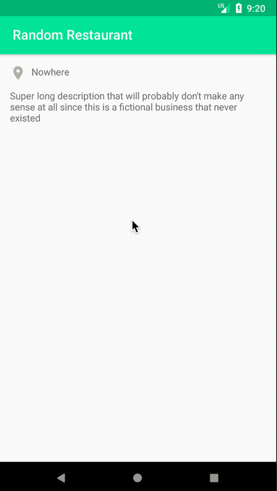

# Fictional Business

This app showcases the information of a fictional business as part of the Android Basics: User 
Interfaces course by Udacity, recreated using the Kotlin programming language.
s
## Screenshots

