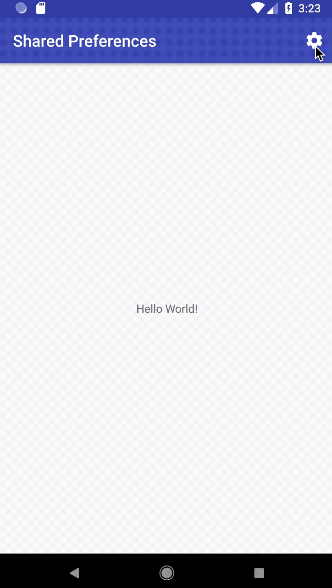

# Book Search app

This app is part of Udacity's [Android Basics: Networking](https://classroom.udacity.com/courses/ud843) 
course, which uses Google's Book API to request data from the server using the [Retrofit](http://square.github.io/retrofit/) 
library made by [Square](http://square.github.io/).

