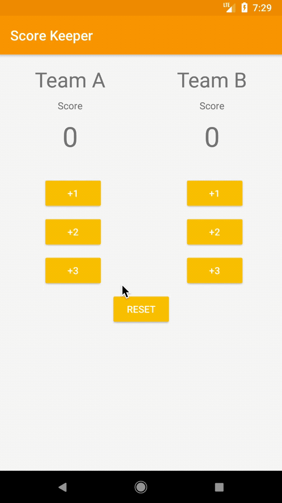

# Score Keeper

This app helps users keep track of the scores of two basketball teams, this is part of the
Android Basics: User Input course by Udacity recreated using the Kotlin programming language.

